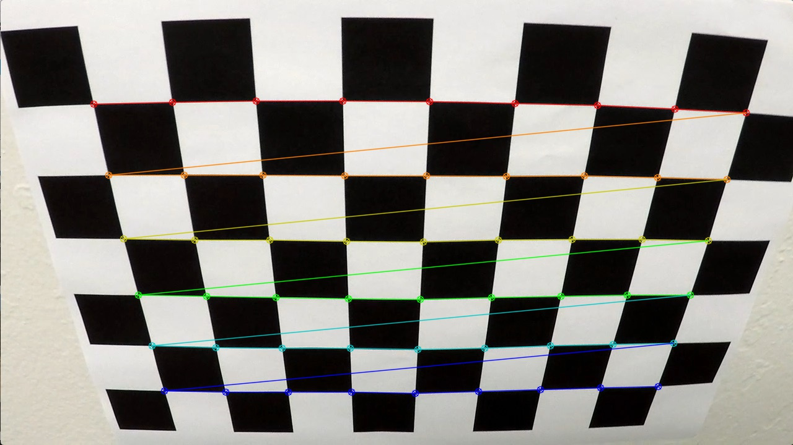
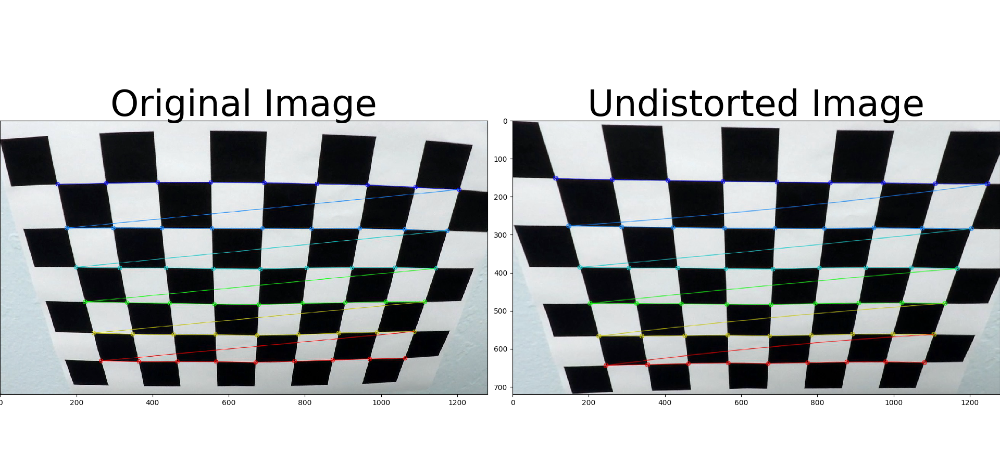
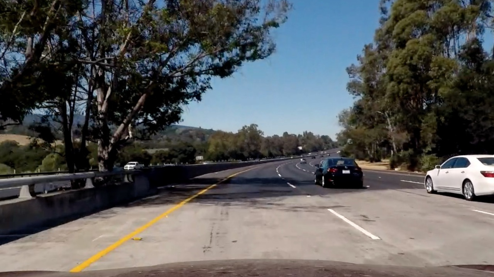
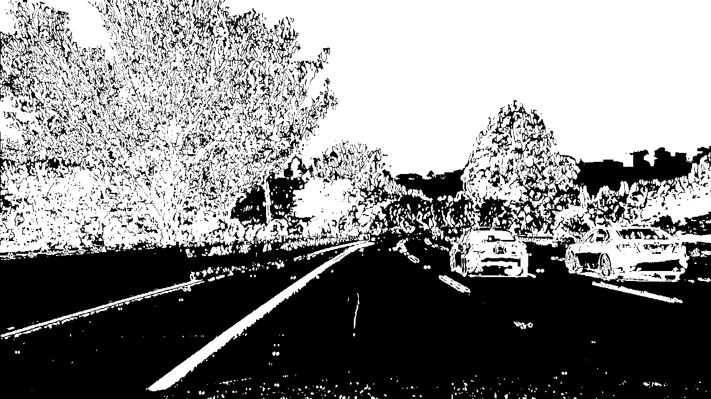
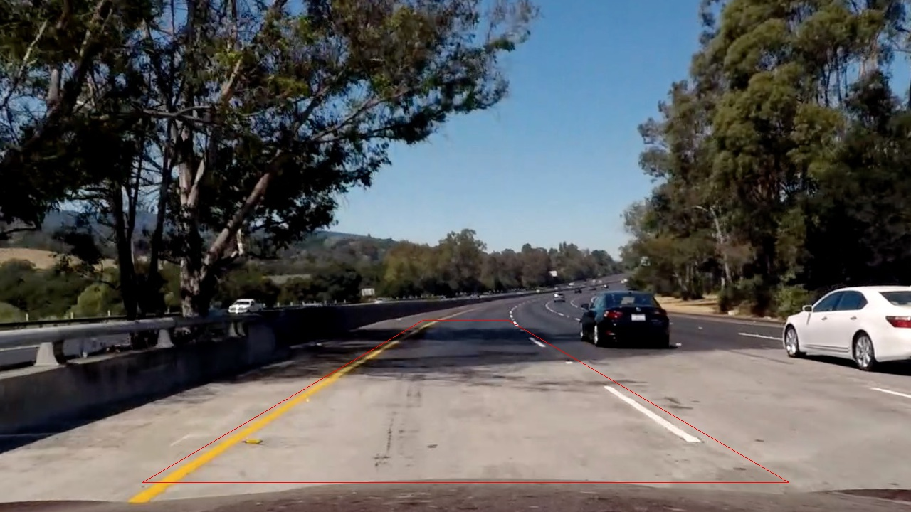
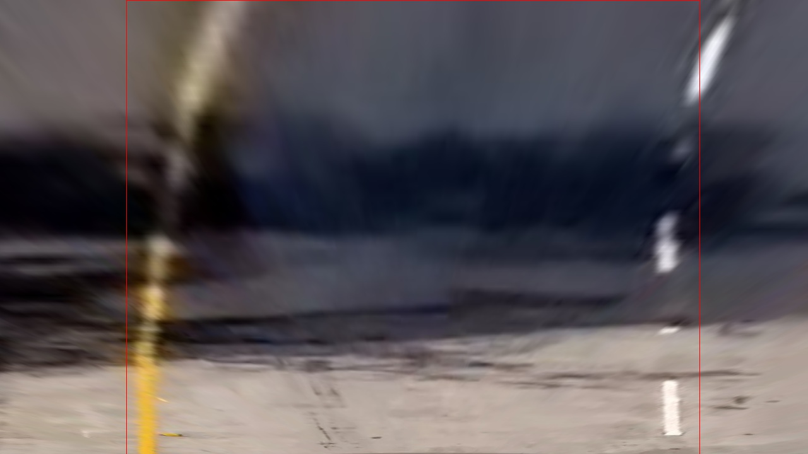
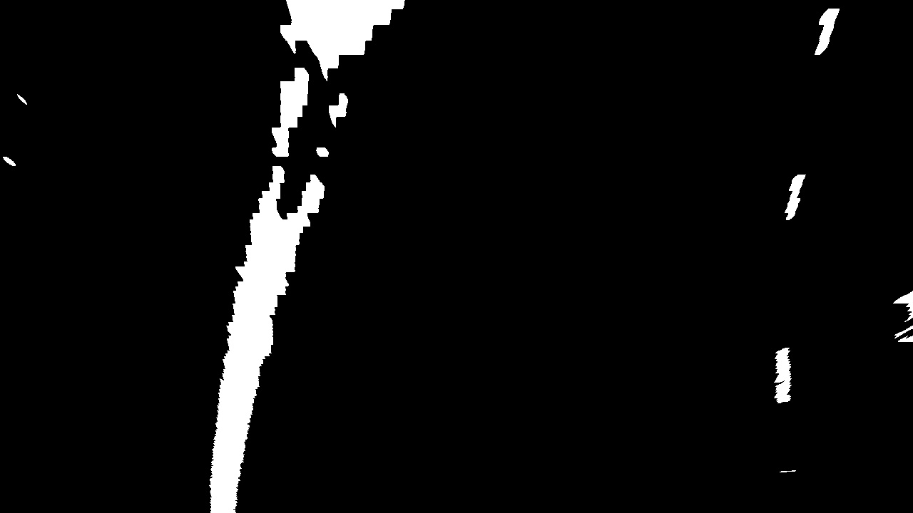
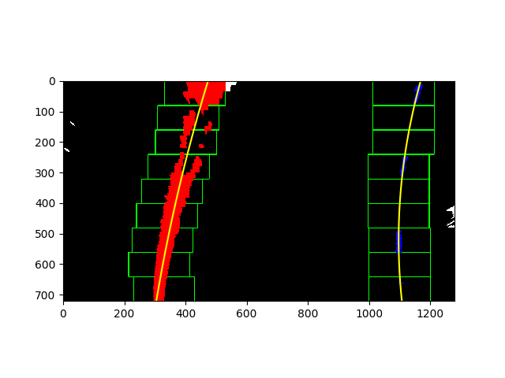
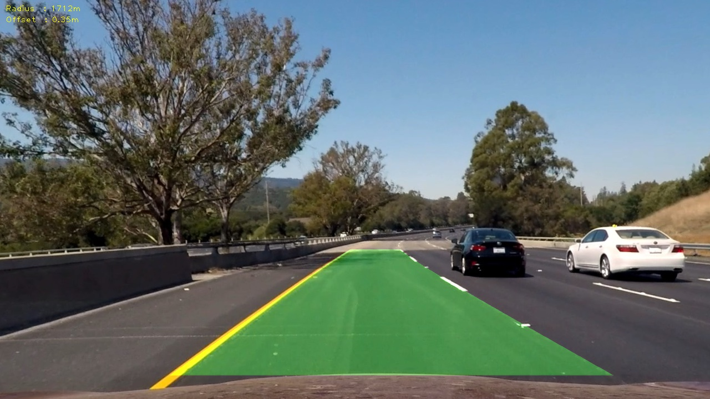

##Advanced Lane Finding

---

**Advanced Lane Finding Project**

The goals / steps of this project are the following:

* Compute the camera calibration matrix and distortion coefficients given a set of chessboard images.
* Apply a distortion correction to raw images.
* Use color transforms, gradients, etc., to create a thresholded binary image.
* Apply a perspective transform to rectify binary image ("birds-eye view").
* Detect lane pixels and fit to find the lane boundary.
* Determine the curvature of the lane and vehicle position with respect to center.
* Warp the detected lane boundaries back onto the original image.
* Output visual display of the lane boundaries and numerical estimation of lane curvature and vehicle position.

[//]: # (Image References)


###Here I will consider the rubric points individually and describe how I addressed each point in my implementation.  

---
###Writeup / README
This is the readme describing my project.

###Camera Calibration

####1. Briefly state how you computed the camera matrix and distortion coefficients. Provide an example of a distortion corrected calibration image.

I start by preparing "object points", which will be the (x, y, z) coordinates of the chessboard corners in the world. Here I am assuming the chessboard is fixed on the (x, y) plane at z=0, such that the object points are the same for each calibration image.  Thus, `objp` is just a replicated array of coordinates, and `objpoints` will be appended with a copy of it every time I successfully detect all chessboard corners in a test image.  `imgpoints` will be appended with the (x, y) pixel position of each of the corners in the image plane with each successful chessboard detection.  

I then used the output `objpoints` and `imgpoints` to compute the camera calibration and distortion coefficients using the `cv2.calibrateCamera()` function.  The code for calibration is in `advanced_lane_finding.py` line 63. I applied this distortion correction to one of the calibration images using the `cv2.undistort()` function and obtained this result: 

#### Calibration image:


#### Calibration image with corners detected:



#### Calibration image undistorted (on the right):



###Pipeline (single images)


####1. Provide an example of a distortion-corrected image.
Distortion correction that was calculated via camera calibration has been applied to each test image. 

As required by criteria in the rubric, **each image** undistorted can be found in [./undistorted](./undistorted) folder.
Here is and example of undistorted image:





####2. Describe how (and identify where in your code) you used color transforms, gradients or other methods to create a thresholded binary image.  Provide an example of a binary image result.

To produce thresholded binary image I used a combination of x gradient thresholding (kernel equal 9 and threshold min equal 10 and max equal 100)) 
and S channel thresholding (threshold min equal 75 and max equal 255). Code for that can be found in `advanced_lane_finding.py` lines 366-371. During 
a process of trial and error I have found that the best results on test video I can get using just x gradient and S channel without any thresholding 
of y gradient, gradient magnitude or gradient direction. The code for thresholding can be found in `advanced_lane_finding.py` lines 97-141.

As required by criteria in the rubric, **example binary images** can be found in [./combined](./combined) folder.


Here is just an example of test6.jpg converted to combined thresholded binary image:




####3. Describe how (and identify where in your code) you performed a perspective transform and provide an example of a transformed image.

The code for my perspective transform includes a function called `warp()` (`advanced_lane_finding.py` lines 90-94). I chose to hardcode the source and destination points in the following manner:

```
WIDTH = 1280
HEIGHT = 720
SRC = np.float32([[200,678], [594,450], [714,450], [1108,678]])
DST = np.float32([[[SRC[0][0],HEIGHT], [SRC[0][0],0], \
                   [SRC[-1][0],0], [SRC[-1][0],HEIGHT]]])

```
Those source and destination points correctly represents an rectangle in a undistorted image:



and perspective transformed image:




As required by criteria in the rubric, **each image** birds-eye view image can be found in [./birds-eye](./birds-eye) folder.
Here is just and example of warped test6.jpg image:




####4. Describe how (and identify where in your code) you identified lane-line pixels and fit their positions with a polynomial?

To find a lane pixels I wrote I function (`advanced_lane_finding.py` lines 201-278) almost identical to the one described in lectures. The only difference is that I have increased
the minimum number of pixels found to recenter window to 100. This method:

+ takes a histogram of the bottom half of the image
+ finds the peak of the left and right halves of the histogram. These will be the starting points for the left and right lines.
+ identifies the x and y positions of all nonzero pixels in the image
+ steps through the sliding windows one by one
+ identifies window boundaries in x and y (and right and left)
+ identifies the nonzero pixels in x and y within the window
+ appends found indices to the list of found line pixels indices
+ extracts found lines pixels using prepared indices
+ fits second order polynomial to found lines pixels

As required by criteria in the rubric, **example images** with line pixels identified and a fit overplotted can be found in [./searched](./searched) folder.

Here is just an example of found lines on test6.jpg image:




####5. Describe how (and identify where in your code) you calculated the radius of curvature of the lane and the position of the vehicle with respect to center.

I did this in `advanced_lane_finding.py` lines 322-332 using the same method as described in lectures: so using a second order polynomial (fitted to lane lines
converted from pixel space to meters space) coefficients and a formula from the lectures.
 


####6. Provide an example image of your result plotted back down onto the road such that the lane area is identified clearly.

I implemented this step in `advanced_lane_finding.py` lines 382-386.

As required by criteria in the rubric, **example image** with line plotted back down onto the road is following ([./output_images/result/test6_result.jpg](test6.jpg)):




---

###Pipeline (video)

####1. Provide a link to your final video output.  Your pipeline should perform reasonably well on the entire project video (wobbly lines are ok but no catastrophic failures that would cause the car to drive off the road!).


Using a pipline which is written in `advanced_lane_finding.py` lines 361-386 I ended up with following [output video](./output.mp4).

---

###Discussion

####1. Briefly discuss any problems / issues you faced in your implementation of this project.  Where will your pipeline likely fail?  What could you do to make it more robust?

Problems and issues:

+ using all the thresholding methods described in the lectures has failed for me. The best result I got using only x gradient and S channel thresholding

Where will your pipeline likely fail?:

+ for sure it will fail on a road that has sharper turns (like normal non-highway road) because I detect bad frames based on the curvature of the found lines
+ will fail when some other car will cut through my line
+ will probably fail on left-right or right-left turns since such curvatures require more than 2nd order polynomial to fit

What could you do to make it more robust?:

+ prepare some other method of bad frames detection => result: more sharp curves detection
+ use more than 2nd order polynomial to fit the lines => result: left-right, right-left turns detection.

