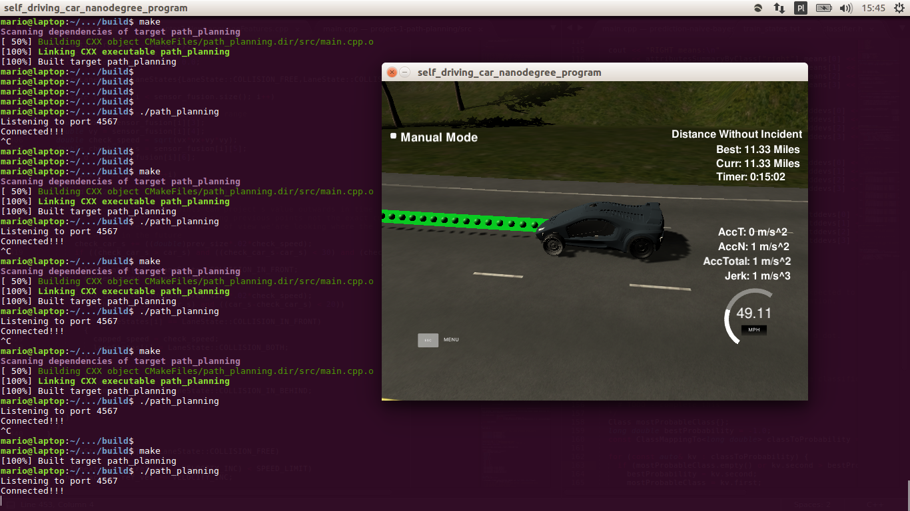

##Path Planning

---

**Path Planning Project**

The goal in this project is to build a path planner that is creates smooth, safe trajectories for the car to follow. The highway track has other vehicles, all going different speeds, but approximately obeying the 50 MPH speed limit.

[//]: # (Image References)
---
###Writeup / README
This is the readme describing my project.

###Here I will consider the rubric points individually.  

###Compilation

####1. The code compiles correctly.

Code compiles without errors with cmake and make.


###Valid Trajectories


####1. The car is able to drive at least 4.32 miles without incident.
The car during driving is not exceeding acceleration/jerk/speed. It avoids collision and driving outside of the lanes. Here is a screenshot of the car being able to drive without incident for more
than 11 miles:





####2. The car drives according to the speed limit.

The car doesn't drive faster than the speed limit. Also the car isn't driving much slower than speed limit unless obstructed by traffic. This is achieved by defining a max speed that the car will
not exceed while increasing speed:

```
\\ line 24:
constexpr double SPEED_LIMIT = 49.5;

\\ line 227:
auto increase_velocity = [&](){
    if ((next_action.ref_vel + VELOCITY_INC) < SPEED_LIMIT)
      next_action.ref_vel += VELOCITY_INC;
};
```


####3. Max Acceleration and Jerk are not Exceeded.

The car does not exceed a total acceleration of 10 m/s^2 and a jerk of 10 m/s^3. This is achieved by two facts:

* increasing the speed only by value which is not too high:
```
    \\ line 23:
    constexpr double VELOCITY_INC = 2.0 * 0.214;
```

* properly placing path waypoints (I will adress that in reflection rubric)


####4. Car does not have collisions.

The car doesn't come into contact with any of the other cars on the road. It is ensured
by always taking an action that takes us to a collision free state. The method is simple: assign a cost of 1.0 to being in a specific line that is collision evident and a cost of 0.0 to collision free line. We take only those lines that has cost 0.0 (collision free). If collision is evident in each line we simply slow down:
```
// line 181:
Action choose_action(double velocity, int lane, vector<vector<int>> sensor_fusion, int prev_size, double car_s)
{
  // car in front avoidance start
  // go through sensor fusion and see if a car is in front of us
  Action next_action{};
  next_action.ref_vel = velocity;
  next_action.lane = lane;
  static double capped_speed = 0.0;

  vector<LaneCost> laneCosts{0.0,0.0,0.0};

  for (size_t i = 0; i < sensor_fusion.size(); i++)
  {
    double vx = sensor_fusion[i][3];
    double vy = sensor_fusion[i][4];
    double check_speed = sqrt(vx*vx+vy*vy);
    double check_car_s = sensor_fusion[i][5];
    float d = sensor_fusion[i][6];

    for (int i =0; i < 3; ++i)
    {
      if(d < (2+4*i+2) and d > (2+4*i-2))
      {
        // if using previous points can project s value outwards in time
        // it is needed cause we're using previous points not the exact current poistion of car
        // so from previous point point of view we'are looking where the
        // car is in the future
        check_car_s += ((double)prev_size*.02*check_speed);
        if ((check_car_s > car_s) and 
            ((check_car_s-car_s) < 30) and 
            (check_speed < velocity+VELOCITY_INC))
        {
          laneCosts[i] += 1.0;
          capped_speed = check_speed;
        }
        // revert s value projection
        check_car_s -= ((double)prev_size*.02*check_speed);
        if ((check_car_s <= car_s) and ((car_s-check_car_s) < 30))
        {
          laneCosts[i] += 1.0;
          capped_speed = check_speed;
        }
      }
    }
  }

  auto increase_velocity = [&](){
    if ((next_action.ref_vel + VELOCITY_INC) < SPEED_LIMIT)
      next_action.ref_vel += VELOCITY_INC;
  };

  // continue driving cost free lane
  if (laneCosts[lane] == 0.0)
  {
    increase_velocity();
  }
  // try lane on the left if current one is not cost free
  else if (lane - 1 >=0 and laneCosts[lane - 1] == 0.0)
  {
    increase_velocity();
    next_action.lane = lane - 1;
  }
  // try lane on the right if current one and on the left are not cost free
  else if (lane + 1 <=2 and laneCosts[lane + 1] == 0.0)
  {
    increase_velocity();
    next_action.lane = lane + 1;
  }
  // if there is no cost free lane follow capped velocity
  else if (all_of(begin(laneCosts), 
                  end(laneCosts), 
                  [](const LaneCost&c){ return c != 0.0; }))
  {
    if ((next_action.ref_vel + VELOCITY_INC) < capped_speed)
      next_action.ref_vel += VELOCITY_INC;
    else
      next_action.ref_vel -= VELOCITY_INC;
  }
  // better slow down in another cases
  else
    next_action.ref_vel -= VELOCITY_INC;

  return next_action;
}
```


####5. The car stays in its lane, except for the time between changing lanes.

The car doesn't spend more than a 3 second length out side the lane lanes during changing lanes, and every other time the car stays inside one of the 3 lanes on the right hand side of the road.
This is done by changing the lines when there is a need to:
```
// line 231:
// try lane on the left if current one is not cost free
else if (lane - 1 >=0 and laneCosts[lane - 1] == 0.0)
{
  increase_velocity();
  next_action.lane = lane - 1;
}
// try lane on the right if current one and on the left are not cost free
else if (lane + 1 <=2 and laneCosts[lane + 1] == 0.0)
{
  increase_velocity();
  next_action.lane = lane + 1;
}
```

The path generation then takes the choosen next line when generating trajectory:
```
// line 401:
// In Frenet add evenly 30m spaced points ahead of the starting reference
vector<double> next_wp0 = getXY(car_s+30, (2+4*lane), map_waypoints_s, map_waypoints_x, map_waypoints_y);
vector<double> next_wp1 = getXY(car_s+60, (2+4*lane), map_waypoints_s, map_waypoints_x, map_waypoints_y);
vector<double> next_wp2 = getXY(car_s+90, (2+4*lane), map_waypoints_s, map_waypoints_x, map_waypoints_y);
```


####6. The car is able to change lanes

The car is able to smoothly change lanes when it makes sense to do so, such as when behind a slower moving car and an adjacent lane is clear of other traffic. This is done by the same techniques as described in point 4. and 5. (same code snippets)


---

###Reflection

####1. Reflection on how to generate paths.

An input to path generator is the lane number where we want the car to be and a velocity that is should go. Both those parameters are procuced by **choose_action** method (line 181) it returns just an instance of an object holding velocity and line number:
```
// line 168:
struct Action
{
  Action(int lane_, double ref_vel_)
  : lane{lane_}
  , ref_vel{ref_vel_}
  {}
  Action() = default;
  int lane{};
  double ref_vel{};
};
```

Having desired lane and speed we can pass it to code for generating paths (lanes 347-473):
```
int prev_size = previous_path_x.size();

if (prev_size > 0)
{
  // assume car s is at the end of lastly generated path
  car_s = end_path_s;
}

auto action = choose_action(ref_vel, lane, sensor_fusion, prev_size, car_s);
ref_vel = action.ref_vel;
lane = action.lane;
```

Then we create a list of widely spaced (x,y) waypoints (evenly spaced at 30m).
Later we will interpolate these points with spline and fill it in with more points that control speed. Either we will reference the starting point as where the car is 
or at the previous path end points. If the previous size is almost empty use the car as the starting points else use the previous path's end point as a starting reference:
```
vector<double> ptsx;
vector<double> ptsy;
double ref_x = car_x;
double ref_y = car_y;
double ref_yaw = deg2rad(car_yaw);

if (prev_size < 2)
{
  double prev_car_x = car_x - cos(car_yaw);
  double prev_car_y = car_y - sin(car_yaw);

  ptsx.push_back(prev_car_x);
  ptsx.push_back(car_x);

  ptsy.push_back(prev_car_y);
  ptsy.push_back(car_y);
} 

else {
  // redefine reference state as previous path end point
  ref_x = previous_path_x[prev_size-1];
  ref_y = previous_path_y[prev_size-1];
  double ref_x_prev = previous_path_x[prev_size-2];
  double ref_y_prev = previous_path_y[prev_size-2];
  ref_yaw = atan2(ref_y - ref_y_prev, ref_x - ref_x_prev);

  // use two points that make the path tangent to the previous path's end point
  ptsx.push_back(ref_x_prev);
  ptsx.push_back(ref_x);

  ptsy.push_back(ref_y_prev);
  ptsy.push_back(ref_y);
}

// using above 2 reference points lets generate next ones:
// In Frenet add evenly 30m spaced points ahead of the starting reference
vector<double> next_wp0 = getXY(car_s+30, (2+4*lane), map_waypoints_s, map_waypoints_x, map_waypoints_y);
vector<double> next_wp1 = getXY(car_s+60, (2+4*lane), map_waypoints_s, map_waypoints_x, map_waypoints_y);
vector<double> next_wp2 = getXY(car_s+90, (2+4*lane), map_waypoints_s, map_waypoints_x, map_waypoints_y);

ptsx.push_back(next_wp0[0]);
ptsx.push_back(next_wp1[0]);
ptsx.push_back(next_wp2[0]);

ptsy.push_back(next_wp0[1]);
ptsy.push_back(next_wp1[1]);
ptsy.push_back(next_wp2[1]);
```

Next we need to shift the points we have so far into car reference frame
(much easier calculations thanks to that):

``` 
for (int i = 0; i < ptsx.size(); i++)
{
  double shift_x = ptsx[i]-ref_x;
  double shift_y = ptsy[i]-ref_y;

  ptsx[i] = (shift_x * cos(0-ref_yaw)-shift_y * sin(0-ref_yaw));
  ptsy[i] = (shift_x * sin(0-ref_yaw)+shift_y * cos(0-ref_yaw));
}
```

Then using a spline library we interpolate points so that the output path
is smooth and ensures car drives desired speed (desired speed ensured by line 453):

```
// create a spline
tk::spline s;
// set x,y points to the spline
s.set_points(ptsx, ptsy);

// define the actual (x,y) points we will use for the planner
vector<double> next_x_vals;
vector<double> next_y_vals;

// start with all of the previous path points from last time
for (int i = 0; i < previous_path_x.size(); i++)
{
  next_x_vals.push_back(previous_path_x[i]);
  next_y_vals.push_back(previous_path_y[i]);
}

// calculate how to break up spline points so that we travel at our desired reference velocity
double target_x = 30.0; // the horizon, we're interpolating 30m ahead
double target_y = s(target_x);
// linearization here:
double target_dist = sqrt(target_x*target_x + target_y * target_y);

double x_add_on = 0;

// fill up the rest of our path planner after filling it with previous points. here we will
// always output 50 points
for (int i = 1; i <= 50-previous_path_x.size(); i++)
{ 
  // 2.24 is used to convert from miles/h to m/s, 0.2 is time per simulation step
  double N = target_dist/(.02*ref_vel/2.24); 
  double x_point = x_add_on+(target_x)/N;
  double y_point = s(x_point);

  x_add_on = x_point;

  double x_ref = x_point;
  double y_ref = y_point;

  // rotate back from car coordinates
  x_point = (x_ref * cos(ref_yaw) - y_ref * sin(ref_yaw));
  y_point = (x_ref * sin(ref_yaw) + y_ref * cos(ref_yaw));
  // and make shift
  x_point += ref_x;
  y_point += ref_y;

  next_x_vals.push_back(x_point);
  next_y_vals.push_back(y_point);
}
```
